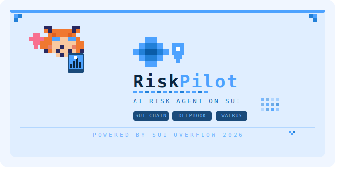

# RiskPilot

<p align="center">
  
</p>

> AI suggests. Policy gates. Wallet confirms. Walrus remembers.

RiskPilot is a Sui Overflow 2026 **Agentic Web** project that explores a safer path for DeFi agents on Sui. It is built around one problem: an AI agent may be useful at reading risk and proposing action, but it should not be able to move user funds just because it produced a confident recommendation.

RiskPilot turns that principle into a full demo loop. It observes a Sui mainnet wallet, detects DeFi exposure, proposes a policy-bound response, checks the agent's authority through an on-chain `AgentPolicy` object, prepares evidence-only PTB proof, and archives signed evidence to Walrus so the decision can be reviewed later.

The goal is not to build an unrestricted trading bot. The goal is to show what a trustworthy Sui Agent could look like: useful enough to reason about risk, but bounded enough that every sensitive step is checked, signed, and remembered.

---

## English Version

### Project Story

DeFi users increasingly rely on dashboards, bots, alerts, and AI assistants to understand fast-moving risk. But most tools stop at one of two extremes: they either only display information, or they ask for broad authority to automate execution.

RiskPilot takes a third path.

It treats the Agent as a risk co-pilot, not a fund controller. The Agent can observe wallet state, explain exposure, simulate possible stress, and prepare a response. But before anything becomes actionable, the plan must pass Policy boundaries, wallet confirmation, and audit packaging. If Policy does not pass, the workflow blocks. If the wallet does not sign, nothing is submitted. If evidence is signed, Walrus preserves the decision trail.

That is the product thesis:

```text
AI can reason.
Policy defines authority.
Wallet signatures confirm intent.
Walrus makes the memory replayable.
```

### What RiskPilot Does

RiskPilot turns a wallet risk review into a five-stage Agent loop:

```text
Observe -> Plan -> Verify Policy -> Act -> Remember
```

Each stage is designed to answer a judge-facing question:

| Stage | Question | RiskPilot Answer |
| --- | --- | --- |
| Observe | What risk does this wallet carry? | Reads Sui mainnet wallet context, owned objects, balances, DeFi hints, and risk signals. |
| Plan | What should an Agent suggest? | Generates a bounded risk response from deterministic signals, What-if simulation, and market evidence. |
| Verify Policy | Is the Agent allowed to do this? | Checks budget, market, asset, expiry, and manual approval boundaries through app/server checks and `AgentPolicy`. |
| Act | Can the action be prepared safely? | Prepares evidence-only PTB proof and signed intent, without default transaction submission. |
| Remember | Can reviewers verify the decision later? | Archives the signed evidence package to Walrus and links it to optional `StrategyReceipt` proof. |

### Why It Is Different

RiskPilot is not just a portfolio dashboard with AI text on top. It focuses on the hard part of Agentic Web products: **authority**.

The project demonstrates that an Agent workflow can be helpful without being dangerous:

- The Agent can suggest, but it cannot silently execute.
- Policy checks happen before action preparation.
- Wallet signatures are required for authority-bearing steps.
- Prepared PTB proof is evidence-only and marked as not submitted.
- Walrus stores the audit memory so the decision can be replayed.
- StrategyReceipt links the strategy, execution digest, signer, and Walrus blob back to Sui.

This creates a visible evidence chain instead of a black-box AI recommendation.

### Sui-Native Design

RiskPilot is designed around Sui primitives rather than treating Sui as a generic chain.

| Sui / Ecosystem Primitive | Role in RiskPilot |
| --- | --- |
| Sui Object Model | Wallet-owned objects, policy objects, receipts, and evidence objects become first-class proof surfaces. |
| `AgentPolicy` object | Represents the Agent's visible authority boundary. |
| Programmable Transaction Blocks | Prepared PTB proof shows the intended action without default live submission. |
| DeepBook | Provides market route and liquidity context for SUI/USDC or USDC/SUI planning. |
| Wallet signature | Confirms user intent for evidence or paid archive operations. |
| Walrus | Stores the signed audit package as durable, replayable memory. |
| `StrategyReceipt` | Optionally links the strategy, execution digest, signer, and Walrus blob on Sui. |

Mainnet package:

```text
0x24972ef5274a577127dc871687e4bfe4bb4d512d810c025cbe01d87ca621c2d7
```

### Agent Architecture

RiskPilot uses a bounded multi-agent workflow:

- **Manager** coordinates the incident and final command.
- **Risk Analyst** identifies deterministic portfolio risk signals.
- **Liquidity Scout** checks DeepBook market evidence.
- **Policy Guard** validates budget, asset, market, expiry, and approval constraints.
- **Execution Planner** prepares the safest allowed action path.
- **Audit Agent** packages the decision trail for Walrus and receipt proof.

The AI layer improves explanation and synthesis. Authority-sensitive decisions stay deterministic: policy validation, execution posture, preview isolation, route eligibility, and wallet signature requirements are not delegated to model output.

### Proof Of Agent Action

The core evidence chain is:

```text
Wallet state
-> Risk report
-> Agent strategy
-> Policy verification
-> Execution intent
-> Evidence-only PTB proof
-> Wallet signature
-> Walrus archive
-> StrategyReceipt
```

This is the key difference between RiskPilot and a normal DeFi dashboard. The product does not only say what the Agent recommends; it shows how the recommendation was bounded, checked, signed, archived, and made reviewable.

### Safety Boundary

RiskPilot keeps the default path conservative:

- Default behavior is prepare-only.
- Evidence signing does not submit a transaction.
- Wallet confirmation is required for authority-bearing actions.
- What-if simulation cannot become a real archive payload.
- Policy checks are recomputed before preparation.
- Walrus archive is explicitly wallet-signed and wallet-paid.
- StrategyReceipt minting is separate and explicit.

This safety posture is important for the demo and for the long-term product direction. A useful DeFi Agent should earn trust by showing its limits.

### Current Strengths

- Clear Agentic Web story: AI suggests, Policy gates, Wallet confirms, Walrus remembers.
- Sui-native proof design using objects, PTB proof, DeepBook, Walrus, and StrategyReceipt.
- Strong safety narrative: the Agent is helpful, but not over-authorized.
- Judge-friendly demo path that shows both product value and technical evidence.
- Practical user scenarios for DeFi wallets, DAO treasuries, funds, and audit-conscious Web3 teams.

### Roadmap

RiskPilot is a hackathon prototype, but the direction is larger than the demo. Future work includes:

- **Protocol coverage:** add adapters for more Sui DeFi protocols beyond the current wallet, DeepBook, and object-evidence flow.
- **Stronger Move enforcement:** expand `AgentPolicy` into richer on-chain mandates, spending scopes, expiry windows, and multi-action constraints.
- **Multi-signer review:** support DAO treasury approvals, institutional co-signers, and role-based review workflows.
- **Live execution mode:** introduce a separate, high-friction live execution path where every fund-moving action is clearly separated from evidence signing.
- **Risk intelligence:** improve scenario modeling, liquidation detection, stablecoin depeg analysis, LP risk, and route quality scoring.
- **Walrus compliance packs:** turn archived decisions into portable audit packets for users, funds, DAOs, and reviewers.
- **Agent marketplace readiness:** make policies reusable so users can safely grant limited mandates to different Agents.

The long-term vision is not an AI trader. It is a verifiable Sui risk Agent that helps users understand exposure, prepare safe action, and preserve a decision trail that others can inspect.

---

## 中文版本

### 项目故事

RiskPilot 是一个面向 Sui DeFi 的风险 Agent。它想解决的问题很直接：AI Agent 可以帮用户分析风险、提出建议，但它不应该因为“看起来很自信”就拥有直接移动用户资产的权力。

所以 RiskPilot 的核心不是“让 AI 自动交易”，而是建立一个更可信的 Agent 工作流：

```text
AI 提建议
Policy 设边界
钱包确认意图
Walrus 记住证据
```

RiskPilot 会读取 Sui mainnet 钱包上下文，识别 DeFi 风险敞口，生成受 Policy 限制的应对方案，检查 `AgentPolicy` 授权边界，准备 evidence-only PTB proof，并把签名证据归档到 Walrus。评审和用户后续可以回放这次决策，看到 Agent 为什么这么建议、谁确认了、证据存在哪里。

### RiskPilot 做了什么

产品被组织成五个阶段：

```text
Observe -> Plan -> Verify Policy -> Act -> Remember
```

| 阶段 | 要回答的问题 | RiskPilot 的做法 |
| --- | --- | --- |
| Observe | 钱包现在有什么风险？ | 读取 Sui mainnet 钱包资产、对象、DeFi 线索和风险信号。 |
| Plan | Agent 会建议什么？ | 根据确定性风险信号、What-if 模拟和市场证据生成风险应对方案。 |
| Verify Policy | Agent 是否被允许这么做？ | 检查预算、市场、资产、过期时间和人工确认边界，并结合 `AgentPolicy` 展示授权范围。 |
| Act | 行动能否安全准备？ | 准备 evidence-only PTB proof 和签名意图，默认不提交交易。 |
| Remember | 之后能不能复核？ | 把签名证据包归档到 Walrus，并可选链接到 `StrategyReceipt`。 |

### 我们的优势

RiskPilot 和普通 DeFi dashboard 最大的区别是：它不只是展示资产和风险，也不只是生成 AI 文案，而是把 Agent 的“权限边界”做成了产品核心。

它强调三个安全点：

- Agent 可以分析和建议，但不能静默执行。
- Policy 检查发生在行动准备之前。
- 钱包签名和 Walrus 归档让决策可以被追溯和验证。

因此 RiskPilot 展示的是一条完整证据链，而不是一个黑盒推荐。

### Sui 原生设计

RiskPilot 使用 Sui 生态原语来构建可信 Agent 工作流：

| Sui / 生态原语 | 在 RiskPilot 中的作用 |
| --- | --- |
| Sui Object Model | 钱包对象、Policy object、Receipt 和证据对象都成为可验证的证明面。 |
| `AgentPolicy` object | 表示 Agent 可以做什么、不可以做什么的授权边界。 |
| Programmable Transaction Blocks | 准备 PTB proof，用于展示行动意图，但默认不提交真实交易。 |
| DeepBook | 提供 SUI/USDC 或 USDC/SUI 行动计划的市场路线和流动性上下文。 |
| 钱包签名 | 用户明确确认 evidence 或付费归档操作。 |
| Walrus | 存储签名审计包，形成可回放的长期记忆。 |
| `StrategyReceipt` | 可选地把 strategy、execution digest、signer 和 Walrus blob 链接回 Sui。 |

Mainnet package:

```text
0x24972ef5274a577127dc871687e4bfe4bb4d512d810c025cbe01d87ca621c2d7
```

### Agent 架构

RiskPilot 使用一个受约束的多 Agent 工作流：

- **Manager**：组织整个 incident，并给出最终指令。
- **Risk Analyst**：识别确定性的投资组合风险信号。
- **Liquidity Scout**：检查 DeepBook 市场证据。
- **Policy Guard**：验证预算、资产、市场、过期时间和审批约束。
- **Execution Planner**：准备最安全的、被允许的行动路径。
- **Audit Agent**：打包 Walrus 归档和 receipt 证明所需的证据。

AI 负责解释和总结，但关键权限判断不交给模型自由发挥。Policy 校验、执行姿态、What-if 隔离、路线可用性、钱包签名要求，都是确定性逻辑。

### Agent 行动证明

RiskPilot 的核心证据链是：

```text
钱包状态
-> 风险报告
-> Agent 策略
-> Policy 验证
-> Execution intent
-> Evidence-only PTB proof
-> 钱包签名
-> Walrus 归档
-> StrategyReceipt
```

这条链让评审不只是看到“Agent 建议了什么”，还能看到建议如何被限制、如何被检查、如何被签名、如何被归档、之后如何复核。

### 安全边界

RiskPilot 的默认行为是保守的：

- 默认只 prepare，不提交真实交易。
- Evidence signing 不会移动资产。
- 涉及权限和付费的操作必须钱包确认。
- What-if 模拟不能直接变成真实归档 payload。
- 准备行动前会重新计算 Policy。
- Walrus 归档由连接钱包签名和支付。
- StrategyReceipt mint 是独立且显式的操作。

这让 RiskPilot 既能展示 Agentic Web 的行动能力，也能清楚说明 Agent 不会越权。

### 未来规划

RiskPilot 现在是黑客松原型，但我们希望把它继续发展成 Sui 上的 Agentic Risk Desk。后续计划包括：

- **扩展协议适配器**：支持更多 Sui DeFi 协议，不只停留在当前 wallet、DeepBook 和对象证据流。
- **强化 Move 层授权**：让 `AgentPolicy` 支持更丰富的预算、资产、时间窗口和多动作约束。
- **多签和 DAO 审批**：支持 DAO treasury、机构钱包和不同角色的联合复核。
- **独立 live execution 模式**：把真实资金流出的动作和 evidence signing 明确拆开，做成高摩擦、强提醒的单独路径。
- **更强风险模型**：增强清算风险、stablecoin 脱锚、LP 无常损失、路由质量和市场冲击分析。
- **Walrus 合规证据包**：把归档结果做成可携带的审计包，服务用户、基金、DAO 和评审。
- **Agent marketplace 准备**：让用户可以用可复用 Policy 给不同 Agent 授予有限权限。

长期来看，我们不想做一个“AI 自动交易机器人”。我们想做的是一个可验证的 Sui 风险 Agent：它能帮助用户理解风险、准备安全行动，并留下别人也能检查的决策记忆。
