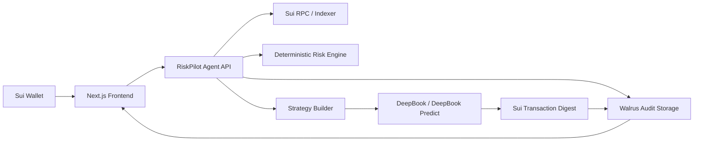

# RiskPilot Project Submission

## English Version

### Project Name

**RiskPilot**

### Tagline

**A verifiable AI risk manager for Sui DeFi.**

### One-Line Summary

RiskPilot helps Sui DeFi users understand portfolio risk, generate protective strategies, execute bounded actions through DeepBook / DeepBook Predict, and store every agent decision as a verifiable audit trail on Walrus.

### Recommended Hackathon Track

**Primary Track: DeepBook**

RiskPilot is designed around the idea that DeepBook is not only a trading venue, but a financial primitive layer for building higher-level risk management products. The project can naturally reference the Agentic Web, DeFi & Payments, and Walrus narratives, but the strongest submission category is DeepBook because the core product turns DeepBook / DeepBook Predict into a user-facing risk protection experience.

### Project Overview

Sui DeFi is growing quickly, but the average user still has very limited visibility into the real risk of their positions. A wallet may hold SUI, stablecoins, liquidity pool positions, lending positions, and open orders across different protocols. Each position has different exposure: price drawdown, liquidation risk, stablecoin concentration, liquidity risk, and impermanent loss.

RiskPilot acts as an AI-native risk layer for this environment. It connects to a user's Sui wallet, reads portfolio and position data, calculates risk signals, generates a human-readable risk report, proposes a bounded hedge or protection strategy, and lets the user approve the action. The strategy can use DeepBook spot orders, margin-style risk controls, or DeepBook Predict-style downside protection. After execution, RiskPilot stores the full decision package on Walrus so that the user, judges, or future integrations can verify what the agent saw, recommended, and executed.

The product is intentionally not a black-box trading bot. It is a policy-constrained risk manager. The user defines spending limits, allowed assets, allowed markets, strategy duration, and whether final confirmation is required. The agent explains and prepares the action, while deterministic checks enforce safety before any transaction is built.

### Problems We Solve

#### 1. DeFi Risk Is Hard To Understand

Most users can see token balances, but they cannot easily answer practical questions such as:

- How much of my portfolio is exposed to SUI price movement?
- What happens if SUI drops 10% in the next week?
- Is my lending position close to liquidation?
- Am I over-concentrated in one stablecoin?
- Does my LP position have meaningful impermanent loss exposure?

RiskPilot turns scattered on-chain positions into a single risk dashboard and explains the impact in plain language.

#### 2. Risk Protection Tools Are Not User-Friendly

Advanced users may know how to use order books, options, prediction markets, or structured products for protection. Most users do not. DeepBook and DeepBook Predict create strong primitives, but users still need an application layer that translates portfolio risk into simple protective actions.

RiskPilot fills that gap by generating strategies such as downside protection, stop-loss-style rebalancing, concentration reduction, or range-based hedges.

#### 3. Financial Agents Need Trust, Limits, And Auditability

An agent that can recommend or execute financial actions must be auditable. Users need to know:

- What data did the agent use?
- Why did it recommend this action?
- What limits did the user approve?
- Did the agent stay within those limits?
- What transaction was executed?
- What changed after execution?

RiskPilot stores agent decisions, portfolio snapshots, risk summaries, policy constraints, and transaction digests in a Walrus audit package.

#### 4. DeepBook Predict Needs Consumer-Grade Use Cases

DeepBook Predict introduces a new way to build prediction and binary outcome markets on Sui. However, a raw market interface is not enough for mainstream DeFi users. RiskPilot turns this primitive into a practical use case: portfolio downside protection and risk-aware strategy construction.

### Core Features

#### 1. Portfolio Scanner

RiskPilot connects to the user's Sui wallet and reads:

- Native SUI balance
- Stablecoin balances
- Selected token balances
- DeepBook-related positions or orders when available
- Demo lending / LP positions for hackathon scenarios
- Transaction digests and account activity needed for the risk report

For the hackathon MVP, the scanner should support real wallet balance data plus structured mock positions so the demo can show sophisticated risk scenarios even if not every Sui protocol integration is complete.

#### 2. Risk Engine

The risk engine converts portfolio data into actionable signals:

- Asset concentration risk
- SUI downside exposure
- Stablecoin concentration risk
- Liquidity risk
- Lending health factor risk
- LP impermanent loss risk
- Portfolio drawdown estimate under selected scenarios

The most important design choice is that the risk engine should be deterministic. The AI model can explain the result, but core risk labels and limits should come from transparent rules.

#### 3. Strategy Builder

The strategy builder maps risk signals to recommended actions:

- Buy downside protection for SUI exposure
- Reduce concentration through a DeepBook swap or limit order
- Set a stop-loss-style order
- Split stablecoin exposure
- Reduce or hedge LP exposure
- Use a DeepBook Predict-style position for binary downside protection

The initial version can support a small set of predefined strategy templates. This is enough for a strong hackathon demo and safer than trying to generate arbitrary financial transactions.

#### 4. Policy And Authorization Layer

Before a strategy can be executed, the user defines or confirms policy constraints:

- Maximum total budget
- Maximum single transaction size
- Allowed tokens
- Allowed markets
- Strategy expiration time
- Confirmation mode: manual approval or semi-automatic execution

The policy layer prevents the agent from exceeding user intent. For MVP, every execution can require explicit wallet approval. Later versions can use session keys or more advanced programmable authorization.

#### 5. DeepBook / DeepBook Predict Execution

RiskPilot can execute or simulate strategies using DeepBook primitives:

- DeepBook spot order for rebalancing
- Limit-order-based defensive execution
- DeepBook Predict-style binary protection
- Testnet execution or signed transaction simulation when direct integration is still evolving

The demo should prioritize visible end-to-end flow: risk detected, strategy generated, policy confirmed, transaction prepared or executed, digest displayed.

#### 6. Walrus Audit Log

After each recommendation or execution, RiskPilot creates an audit package containing:

- Wallet address
- Portfolio snapshot
- Market snapshot
- Risk score before action
- Agent explanation
- Strategy template and parameters
- User policy constraints
- Transaction digest or simulation result
- Risk score after action
- Timestamp

The audit package is uploaded to Walrus, and the user receives a Walrus blob ID / link. This turns the agent into a verifiable financial workflow rather than an opaque black box.

### Product Flow

1. The user connects a Sui wallet.
2. RiskPilot scans portfolio and demo DeFi positions.
3. The dashboard shows portfolio composition and risk scores.
4. The user selects a goal such as "protect against SUI downside".
5. The agent generates a recommended strategy.
6. The user reviews the risk, cost, expected protection, and policy limits.
7. The user approves execution or simulation.
8. RiskPilot submits the transaction or records a testnet/simulated result.
9. RiskPilot uploads the audit package to Walrus.
10. The user sees the transaction digest, Walrus proof, and updated risk dashboard.

### Innovation

#### 1. Agentic Risk Management Instead Of Agentic Speculation

Many AI trading projects focus on autonomous profit-seeking. RiskPilot focuses on protection, explainability, and bounded execution. This makes the use case more trustworthy and better aligned with real DeFi users.

#### 2. DeepBook As A Risk Primitive Layer

RiskPilot uses DeepBook as more than a trading backend. It demonstrates how order-book and prediction-market primitives can become user-facing protection products.

#### 3. Verifiable Agent Decisions With Walrus

The project uses Walrus where it is naturally valuable: storing decision records, portfolio snapshots, market data, and transaction evidence. This creates an audit layer for financial agents.

#### 4. Policy-First AI Execution

RiskPilot does not give the AI unlimited authority. The user creates explicit limits, and deterministic checks enforce those limits before execution. This is a practical pattern for future agentic finance.

#### 5. Cross-Track Narrative Without Losing Focus

RiskPilot touches all four Sui Overflow 2026 themes:

- DeepBook: financial execution and protection strategies
- Agentic Web: AI-native agent workflow
- DeFi & Payments: portfolio and treasury risk management
- Walrus: verifiable data and memory layer

However, the product remains focused enough to submit under one track.

### Why Now

The timing is strong for three reasons.

First, Sui DeFi has enough activity for users to need better portfolio tooling. Second, DeepBook and DeepBook Predict provide the primitives for more advanced financial applications. Third, AI agents are moving from chat interfaces to transaction-capable workflows, but financial agents need permissioning, safety, and auditability before users can trust them.

RiskPilot sits at the intersection of these shifts.

### Target Users

- Sui DeFi users with concentrated exposure
- Liquidity providers who want downside visibility
- Lending users who need liquidation awareness
- DAO treasuries managing Sui-native assets
- Wallets or DeFi frontends that want embedded risk insights
- Advanced users experimenting with DeepBook Predict strategies

### Technical Architecture

### Hackathon MVP Scope

The first complete demo should include:

- Wallet connection
- Real Sui balance reading
- Demo portfolio positions
- Risk dashboard
- AI-generated explanation
- Strategy recommendation
- Policy confirmation screen
- DeepBook transaction simulation or testnet execution
- Walrus audit upload
- Final result page with transaction digest / simulation ID and Walrus blob ID

### Future Roadmap

#### Short Term

- Add more real Sui DeFi protocol integrations
- Expand DeepBook Predict strategy templates
- Improve market data ingestion
- Add session-key-based execution
- Add better risk visualization

#### Medium Term

- DAO treasury mode
- LP impermanent loss simulator
- Automated alerts and recurring risk checks
- Multi-agent strategy review
- Public audit explorer for agent decisions

#### Long Term

- Institutional risk dashboard
- Cross-protocol hedge execution
- Insurance-like structured products
- Wallet and DeFi protocol integrations
- Risk marketplace for strategy templates

### Success Metrics

- Time from wallet connection to risk report
- Number of risk categories detected
- Number of supported strategy templates
- Percentage of agent decisions stored with full audit data
- Transaction success rate
- Reduction in measured portfolio risk after recommended action
- User clarity: can a user understand why the agent recommended the strategy?

### References

- Sui Overflow 2026: https://overflow.sui.io/
- DeepBook: https://deepbook.tech/
- DeepBook Predict announcement: https://blog.sui.io/introducing-deepbook-predict/
- Walrus documentation: https://docs.wal.app/
- Walrus data security: https://docs.wal.app/docs/data-security

---

## 中文版本

### 项目名称

**RiskPilot**

### 项目口号

**为 Sui DeFi 打造可验证的 AI 风险管理层。**

### 一句话介绍

RiskPilot 帮助 Sui DeFi 用户理解资产组合风险，生成保护型策略，通过 DeepBook / DeepBook Predict 执行有边界的金融操作，并把每一次 agent 决策记录存入 Walrus，形成可验证的审计轨迹。

### 推荐参赛赛道

**主赛道：DeepBook**

RiskPilot 的核心不是简单做一个 AI 聊天机器人，也不是普通钱包工具，而是把 DeepBook / DeepBook Predict 变成普通用户可以理解和使用的风险保护产品。因此主赛道选择 DeepBook 最有说服力。

项目同时天然覆盖：

- Agentic Web：AI agent 识别风险、生成策略、执行工作流
- DeFi & Payments：保护 DeFi 资金和资产组合
- Walrus：存储 agent 决策、授权、市场快照和交易结果

但是最终提交时，最建议选择 DeepBook 作为主赛道。

### 项目概述

Sui DeFi 正在快速发展，但普通用户仍然很难理解自己真正承担了哪些风险。一个钱包里可能同时有 SUI、稳定币、LP 仓位、借贷仓位、DeepBook 订单和其他协议资产。每一种资产和仓位都有不同风险，例如价格下跌、清算、稳定币集中、流动性不足、无常损失等。

RiskPilot 是一个 AI-native 的风险管理层。用户连接 Sui 钱包后，RiskPilot 会读取资产和仓位数据，计算风险信号，生成可读的风险报告，然后基于用户目标推荐保护策略。策略可以使用 DeepBook 现货订单、限价单、防御性再平衡，或者 DeepBook Predict 风格的下跌保护。执行后，RiskPilot 会把完整决策包上传到 Walrus，让用户可以验证 agent 当时看到了什么、推荐了什么、用户授权了什么、最终执行了什么。

RiskPilot 不是黑盒自动交易机器人。它是一个有权限边界的风险管理 agent。用户可以设置预算、允许资产、允许市场、策略有效期和是否必须二次确认。AI 负责解释和生成策略草案，真正的风险判断和交易限制由确定性规则执行。

### 解决的痛点

#### 1. DeFi 风险很难看懂

大部分用户只能看到 token 余额，但很难回答这些问题：

- 我的资产有多少暴露在 SUI 价格波动里？
- 如果 SUI 一周内下跌 10%，我的组合可能损失多少？
- 我的借贷仓位是否接近清算？
- 我是不是过度集中在某一个稳定币？
- 我的 LP 仓位是否有明显的无常损失风险？

RiskPilot 把分散的链上仓位整理成一个统一的风险仪表盘，并用自然语言解释影响。

#### 2. 普通用户缺少简单的风险保护入口

专业用户可能知道如何使用订单簿、期权、预测市场或结构化产品来保护仓位，但普通用户不会自己组合这些工具。DeepBook 和 DeepBook Predict 提供了强大的金融 primitive，但仍然需要应用层把它们转化成用户能理解的保护策略。

RiskPilot 负责把风险信号转换成具体动作，例如下跌保护、止损式再平衡、降低集中度、稳定币拆分、LP 风险对冲等。

#### 3. 金融 agent 最大的问题是信任

一个能推荐或执行金融操作的 agent 必须可验证。用户需要知道：

- agent 使用了哪些数据？
- 为什么推荐这个操作？
- 用户授权的范围是什么？
- agent 有没有超出权限？
- 最终执行了哪笔交易？
- 执行之后风险有没有下降？

RiskPilot 会把 agent 决策、仓位快照、风险摘要、用户授权和交易 digest 存到 Walrus，形成可追溯的审计包。

#### 4. DeepBook Predict 缺少面向用户的应用层

DeepBook Predict 提供了在 Sui 上构建预测市场和二元结果市场的新能力。但如果只提供原始市场界面，普通 DeFi 用户很难直接使用。RiskPilot 把这个 primitive 转化为一个具体场景：资产组合下跌保护和风险管理策略。

### 核心功能

#### 1. Portfolio Scanner 资产扫描器

RiskPilot 连接用户 Sui 钱包后读取：

- SUI 余额
- 稳定币余额
- 选定 token 余额
- DeepBook 相关仓位或订单
- 黑客松 demo 中的借贷 / LP 模拟仓位
- 用于生成风险报告的交易 digest 和账户活动

MVP 阶段建议支持真实钱包余额 + 结构化 mock 仓位。这样既有真实链上交互，又能完整展示复杂风险场景。

#### 2. Risk Engine 风险引擎

风险引擎把仓位数据转换成可行动的风险信号：

- 资产集中度风险
- SUI 下跌暴露
- 稳定币集中风险
- 流动性风险
- 借贷健康度风险
- LP 无常损失风险
- 不同价格情景下的组合回撤估算

这里最重要的设计是：核心风险判断应该用确定性规则，而不是完全交给 AI。AI 可以负责解释，但风险等级、预算上限和执行限制应该由透明规则计算。

#### 3. Strategy Builder 策略生成器

策略生成器把风险信号映射成推荐动作：

- 针对 SUI 暴露购买下跌保护
- 通过 DeepBook swap 或限价单降低集中度
- 设置止损式防御订单
- 拆分稳定币风险
- 降低或对冲 LP 暴露
- 使用 DeepBook Predict 风格的二元保护仓位

MVP 阶段只需要支持少量预设策略模板。这样更安全，也更适合黑客松 demo。

#### 4. Policy And Authorization 权限与授权层

策略执行前，用户需要定义或确认权限：

- 最大总预算
- 单笔交易上限
- 允许使用的 token
- 允许使用的市场
- 策略过期时间
- 执行模式：手动确认或半自动执行

这个权限层保证 agent 不会超出用户意图。MVP 可以要求每次交易都由钱包手动签名；未来可以升级为 session key 或更高级的可编程授权。

#### 5. DeepBook / DeepBook Predict 执行

RiskPilot 可以通过 DeepBook primitive 执行或模拟策略：

- DeepBook 现货订单用于再平衡
- 限价单用于防御性执行
- DeepBook Predict 风格的二元保护
- testnet 执行或签名交易模拟

黑客松 demo 的重点应该是完整流程可见：发现风险、生成策略、确认权限、构建交易、展示 digest。

#### 6. Walrus Audit Log 审计日志

每次推荐或执行后，RiskPilot 会创建一个审计包：

- 钱包地址
- 仓位快照
- 市场快照
- 执行前风险评分
- agent 解释
- 策略模板和参数
- 用户授权约束
- 交易 digest 或模拟结果
- 执行后风险评分
- 时间戳

审计包上传到 Walrus，用户获得 Walrus blob ID / 链接。这样 RiskPilot 不是一个不可追溯的黑盒 agent，而是一个可验证的金融工作流。

### 用户流程

1. 用户连接 Sui 钱包。
2. RiskPilot 扫描资产和 demo DeFi 仓位。
3. Dashboard 展示资产组成和风险评分。
4. 用户选择目标，例如“保护 SUI 下跌风险”。
5. Agent 生成推荐策略。
6. 用户查看风险、成本、预期保护效果和权限限制。
7. 用户确认执行或模拟。
8. RiskPilot 提交交易或记录 testnet / 模拟结果。
9. RiskPilot 上传审计包到 Walrus。
10. 用户看到交易 digest、Walrus proof 和更新后的风险仪表盘。

### 创新点

#### 1. 做风险管理，而不是做 AI 炒币

很多 AI 交易项目强调自动赚钱，但这类项目难以证明，也容易让用户不信任。RiskPilot 选择风险保护、可解释性和权限边界作为核心，更适合真实 DeFi 用户。

#### 2. 把 DeepBook 作为风险管理 primitive

RiskPilot 不只是把 DeepBook 当交易后端，而是展示如何用订单簿和预测市场 primitive 构建面向用户的保护型产品。

#### 3. 用 Walrus 解决金融 agent 的可验证性

Walrus 在这里不是被动存文件，而是用于存储决策记录、仓位快照、市场数据和交易证据。它成为金融 agent 的审计层。

#### 4. Policy-first 的 AI 执行模式

RiskPilot 不给 AI 无限权限。用户先定义边界，系统再用确定性检查保证 agent 不越界。这是 agentic finance 走向真实使用的关键模式。

#### 5. 横跨四个赛道但主线清晰

RiskPilot 同时覆盖四个方向：

- DeepBook：金融执行和保护策略
- Agentic Web：AI-native agent 工作流
- DeFi & Payments：资产组合和资金风险管理
- Walrus：可验证数据和记忆层

但它不是四个方向的拼凑，而是围绕“可验证 AI 风险管理”这一条主线展开。

### 为什么现在适合做

现在是做 RiskPilot 的好时机。

第一，Sui DeFi 已经有足够多的用户和资金，用户需要更好的风险工具。第二，DeepBook 和 DeepBook Predict 提供了更高级金融应用所需的 primitive。第三，AI agent 正在从聊天界面走向能执行交易的工作流，但金融 agent 想被用户信任，必须具备权限控制、安全边界和可审计性。

RiskPilot 正好位于这三个趋势的交叉点。

### 目标用户

- 有集中仓位的 Sui DeFi 用户
- 希望理解下跌风险的 LP
- 需要清算风险提醒的借贷用户
- 管理 Sui-native 资产的 DAO treasury
- 希望嵌入风险能力的钱包或 DeFi 前端
- 想尝试 DeepBook Predict 策略的高级用户

### 技术架构

### 黑客松 MVP 范围

第一个完整 demo 应包含：

- 钱包连接
- 真实 Sui 余额读取
- demo 资产组合仓位
- 风险仪表盘
- AI 生成解释
- 策略推荐
- 权限确认页面
- DeepBook 交易模拟或 testnet 执行
- Walrus 审计包上传
- 结果页展示 transaction digest / simulation ID 和 Walrus blob ID

### 未来路线图

#### 短期

- 接入更多真实 Sui DeFi 协议
- 扩展 DeepBook Predict 策略模板
- 改进市场数据获取
- 增加 session key 执行能力
- 优化风险可视化

#### 中期

- DAO treasury 模式
- LP 无常损失模拟器
- 自动风险提醒和周期性检查
- 多 agent 策略复核
- agent 决策公开审计浏览器

#### 长期

- 机构级风险仪表盘
- 跨协议对冲执行
- 类保险结构化产品
- 钱包和 DeFi 协议集成
- 策略模板市场

### 成功指标

- 从钱包连接到生成风险报告的时间
- 可识别的风险类别数量
- 支持的策略模板数量
- 有完整审计数据的 agent 决策比例
- 交易成功率
- 推荐动作执行后的组合风险下降幅度
- 用户是否能理解 agent 为什么推荐该策略

### 参考资料

- Sui Overflow 2026: https://overflow.sui.io/
- DeepBook: https://deepbook.tech/
- DeepBook Predict 公告: https://blog.sui.io/introducing-deepbook-predict/
- Walrus 文档: https://docs.wal.app/
- Walrus 数据安全: https://docs.wal.app/docs/data-security
